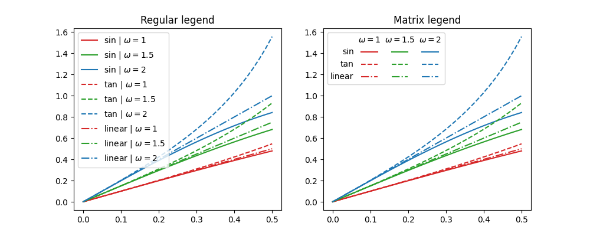

# Matrix legend for Matplotlib

A small extension for [Matplotlib](https://matplotlib.org/)'s Legend to create
matrix legends for plots parametrized with cartesian product of two grids.
Consider the following toy example of evaluating different functions with
different "frequency" parameter values. Full enumeration of function+parameter
pairs gets cumbersome very quickly, but the same information can be naturally
presented in a table layout.

Since most of the functionality is inherited directly from the normal 
Legend class, the styling, layout, custom legends should work more or less
as expected.
